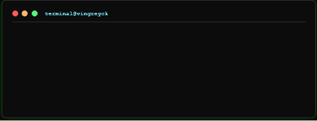

<div align="center">
<a href="https://vingreyck.github.io">
  
</a>
</div>
---

## 👨‍💻 About Me

```dart
class Developer {
  final String name = "Vinícius Lima Santos";
  final String role = "Flutter Developer";
  final String location = "Itabaiana, Sergipe - Brazil";
  final String education = "Sistemas de Informação - UFS";
  final List<String> primaryStack = ["Flutter", "Dart"];
  final List<String> complementarySkills = ["C#", "JavaScript", "Python"];
  
  final Map<String, List<String>> technologies = {
    "mobile": ["Flutter", "Dart"],
    "web": ["C#", ".NET", "JavaScript", "HTML5", "CSS3"],
    "backend": ["Python", "C#", ".NET Core"],
    "tools": ["Git", "GitHub", "VS Code", "Visual Studio"],
  };
  
  final String currentFocus = "Building cross-platform mobile applications with Flutter";
  final String featuredProject = "SeeNet - AI-powered Flutter application";
  
  void introduceMyself() {
    print("Passionate about creating beautiful and functional mobile experiences! 📱✨");
  }
}
```

## 📊 GitHub Analytics

<!--START_SECTION:waka-->
 

**🐱 My GitHub Data** 

**I'm an Early 🐤** 

```text
🌞 Morning                 commits ██████░░░░░░░░░░░░░░░░░░░   
🌆 Daytime                 commits ██████████░░░░░░░░░░░░░░░   
🌃 Evening                 commits ███████░░░░░░░░░░░░░░░░░░   
🌙 Night                   commits ████░░░░░░░░░░░░░░░░░░░░░   
```

**📅 I'm Most Productive on** 

```text
Monday       commits ███░░░░░░░░░░░░░░░░░░░░░░   
Tuesday      commits ████░░░░░░░░░░░░░░░░░░░░░   
Wednesday    commits ████░░░░░░░░░░░░░░░░░░░░░   
Thursday     commits ███░░░░░░░░░░░░░░░░░░░░░░   
Friday       commits ██░░░░░░░░░░░░░░░░░░░░░░░   
Saturday     commits ███░░░░░░░░░░░░░░░░░░░░░░   
Sunday       commits ██████░░░░░░░░░░░░░░░░░░░   
```

**📊 This Week I Spent My Time On** 

```text
💬 Programming Languages: 
Dart         ████████████████████░░░░░   82.5%
C#           ████░░░░░░░░░░░░░░░░░░░░░   8.2%
JavaScript   ██░░░░░░░░░░░░░░░░░░░░░░░   4.8%
Python       █░░░░░░░░░░░░░░░░░░░░░░░░   2.8%
HTML         █░░░░░░░░░░░░░░░░░░░░░░░░   1.7%
```

**🔥 Editors:** 
```text
VS Code      ████████████████████████░   95.2%
Visual Studio ██░░░░░░░░░░░░░░░░░░░░░░░   4.8%
```

**💻 Operating System:** 
```text
Linux        ████████████████░░░░░░░░░   68.3%
Windows      ████████░░░░░░░░░░░░░░░░░   31.7%
```
<!--END_SECTION:waka-->

<div align="center">


</div>

## 🛠️ Tech Stack

### 📱 **Mobile Development (Primary Focus)**


### 🌐 **Web Development (Complementary)**


### ⚙️ **Backend & Scripting**


### 🛠️ **Development Tools**


## 🚀 Featured Projects

**[Explore meu portfolio completo](https://vingreyck.github.io/)**

### 🌟 SeeNet - **Main Project**
AI-powered Flutter application demonstrating advanced mobile development techniques, clean architecture, and innovative user experience design.

**Tech Stack:** `Flutter` `Dart` `AI Integration` `Clean Architecture`  
**Highlights:** Advanced UI/UX, State Management, AI Features

### 🔗 OtherSide
Peer-to-peer communication system showcasing network programming and real-time data exchange capabilities.

**Tech Stack:** `Python` `Socket Programming` `P2P Architecture`

### 🏢 AjudAki
Professional service management platform with comprehensive business logic implementation.

**Tech Stack:** `C#` `.NET` `Web Development`

### 🌍 EcoConecta
Environmental awareness web application focused on sustainability and community engagement.

**Tech Stack:** `HTML5` `CSS3` `JavaScript`

### 💼 AutomacaoSalasWeb
Business management web system featuring dashboard interfaces and data visualization.

**Tech Stack:** `JavaScript` `Web Development`

### ⚙️ AutomacaoClienteQueda
Data processing application with API integration capabilities.

**Tech Stack:** `Python` `API Integration`

## 🎓 Education

**Bachelor's Degree in Information Systems**  
*Universidade Federal de Sergipe (UFS)*  
*In Progress*

## 📈 GitHub Activity Graph


## 🏆 GitHub Trophies

<div align="center">


</div>

## 📫 Connect With Me

<div align="center">
[](https://vingreyck.github.io/)
[](https://www.linkedin.com/in/vinícius-lima-santos-742b06273)
[](https://github.com/Vingreyck)

</div>

---

<div align="center">


*Last updated: Automatically via GitHub Actions*

</div>
